# AI-Driven EVM Gas Optimization at the Compiler Level

### A Machine-Learning Guided Yul Pass Orchestrator for the Solidity Compiler — Mathematical Specification

---

> Every smart contract deployed on Ethereum has a financial cost attached to every operation it executes — gas. This document expands the architectural proposal into a rigorous mathematical treatment, with full derivations for the reinforcement learning formulation and constrained optimization theory.

---

## Table of Contents

1. [Why This Exists](#1-why-this-exists)
2. [The Architecture](#2-the-architecture)
3. [The Full Pipeline — Rust, Python, and C++](#3-the-full-pipeline)
4. [Multi-Agent Extension for Large Contracts](#4-multi-agent-extension)
5. [Known Hard Problems and Mitigations](#5-known-hard-problems)
6. [Comparative Analysis](#6-comparative-analysis)
7. [The Research Gap](#7-the-research-gap)
8. [The Bytecode Superoptimizer — Full Mathematical Treatment](#8-the-bytecode-superoptimizer)
9. [Open Questions](#9-open-questions)
10. [Orchestration and DevEx Layer](#10-orchestration-and-devex)
11. [References](#references)

---

## 1. Why This Exists

Gas is not an abstract performance metric. On Ethereum mainnet the average DeFi user pays between three and thirty dollars per transaction, and every cent of that cost traces back to specific opcodes executing inside a smart contract. Reducing gas is a direct reduction in the financial friction of the entire Web3 ecosystem.

The standard industry response has been manual optimization: developers learn which Solidity patterns are expensive and rewrite accordingly. This works at small scale but breaks down for complex protocols, and manual rewrites frequently introduce security vulnerabilities. The compiler already knows how to perform safe, formally verified transformations. It just applies them in the wrong order for most contracts.

### 1.1 The Phase-Ordering Problem

When `solc` compiles a Solidity contract it translates the source into Yul before generating EVM bytecode. The Yul optimizer then runs approximately 24 named transformation passes — dead code elimination, function inlining, common subexpression elimination, SSA conversion, and others — in a fixed hardcoded sequence:

```
dhfoDxaeul:Ul[xa]EuL
```

The problem is that applying function inlining before dead code elimination on a contract with deeply recursive helper functions produces a different, often worse result than applying dead code elimination first. The optimal ordering depends on the specific topology of the contract's abstract syntax tree.

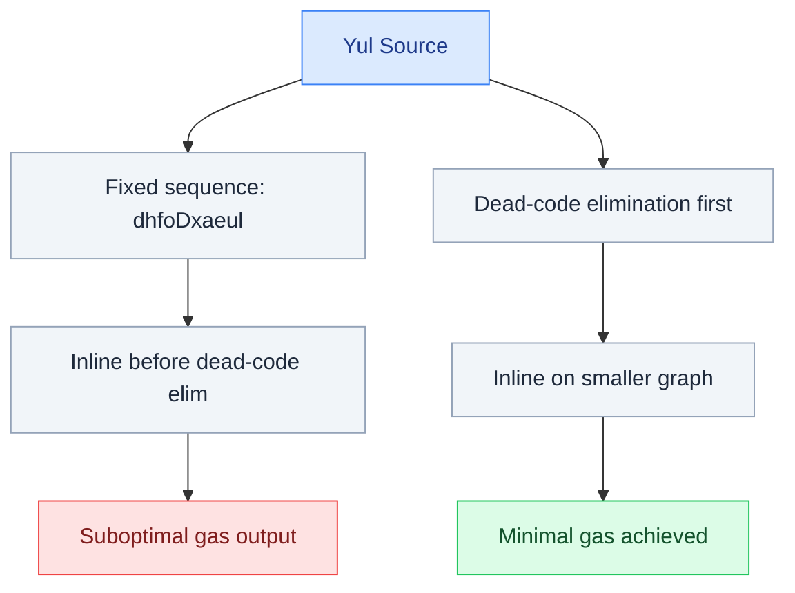

### 1.2 Why Now

Two things happened in mid-2025 that made this tractable. First, the YulCode dataset was published — 350,000 smart contract instances expressed natively in Yul, derived from the Ethereum mainnet. Second, the Yul2Vec paper (August 2025) formally proposed the first method for embedding Yul programs as continuous vectors. Nobody has yet connected them to a working optimizer.

---

## 2. The Architecture

The system has three components that operate in sequence: a graph encoder that converts Yul programs into vector representations, a reinforcement learning agent that selects which optimization pass to apply next, and a correctness gate that verifies outputs before they are returned.


### 2.1 The Yul Graph Encoder

The encoder converts a Yul intermediate representation into a fixed-size vector that the RL agent can reason about. Yul programs are heterogeneous directed graphs where nodes represent different kinds of program elements and edges represent different kinds of relationships.

**Node Types:**

| Node Type  | Description                                       |
| ---------- | ------------------------------------------------- |
| `OPCODE`   | An EVM builtin instruction (e.g., `ADD`, `SLOAD`) |
| `VARIABLE` | A let-bound name, one node per SSA assignment     |
| `LITERAL`  | A constant value                                  |
| `BLOCK`    | A basic block with single entry and exit          |
| `FUNCTION` | A Yul function definition                         |

**Edge Types:**

| Edge Type        | Description                      |
| ---------------- | -------------------------------- |
| AST parent-child | Syntactic containment            |
| Data-flow        | Variable definition to use       |
| Control-flow     | Between blocks                   |
| Call edges       | Call site to function definition |
| SSA phi edges    | At control flow join points      |

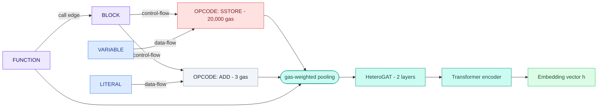

**Gas-weighted pooling.** The pooling strategy weights `OPCODE` nodes by their log-normalised gas cost:

$$h_{\text{contract}} = \text{Pool}\left(\left\{ w_i \cdot h_i \;\middle|\; i \in \text{OPCODE nodes}\right\}\right), \quad w_i = \frac{\log(\text{gas}(i) + 1)}{\sum_j \log(\text{gas}(j) + 1)}$$

**Pre-training objectives** on the 350,000-contract YulCode dataset:

1. **Gas regression:** $\mathcal{L}_{\text{reg}} = \mathbb{E}_p\left[\left(\log G(p) - \log \hat{G}(p)\right)^2\right]$
2. **Pass applicability classification:** $\mathcal{L}_{\text{cls}} = \mathbb{E}_p\left[\sum_{k=1}^{24} \text{BCE}\left(y_k(p),\, \hat{y}_k(p)\right)\right]$

Total: $\mathcal{L}_{\text{pre}} = \mathcal{L}_{\text{reg}} + \alpha \cdot \mathcal{L}_{\text{cls}}$

### 2.2 The Reinforcement Learning Agent

The RL agent is a PPO policy network $\pi_\theta$ that takes the contract embedding as input and outputs a probability distribution over the 24 available optimizer passes. Credit assignment uses three mechanisms: a Process Reward Model (PRM) for dense step-level reward, step-level advantage estimation, and behavioural cloning warmup.

**Action masking for pass preconditions:**

$$\pi_\theta(a_t \mid s_t) = \text{softmax}\left(\text{logits}(s_t) \odot \mathbf{m}(s_t)\right)$$

### 2.3 The Correctness Gate

For original bytecode $B_{\text{orig}}$ and optimized bytecode $B_{\text{opt}}$, the fuzzer verifies for all test inputs $x \in \mathcal{X}$:

1. $\text{output}(B_{\text{opt}}, x) = \text{output}(B_{\text{orig}}, x)$
2. $\text{storage}(B_{\text{opt}}, x) = \text{storage}(B_{\text{orig}}, x)$
3. $\text{gas}(B_{\text{opt}}, x) \leq \text{gas}(B_{\text{orig}}, x)$

---

## 3. The Full Pipeline

The system spans three languages: Python (PyTorch, RL training), Rust (fast EVM execution via `revm`), and C++ (Solidity compiler modification).

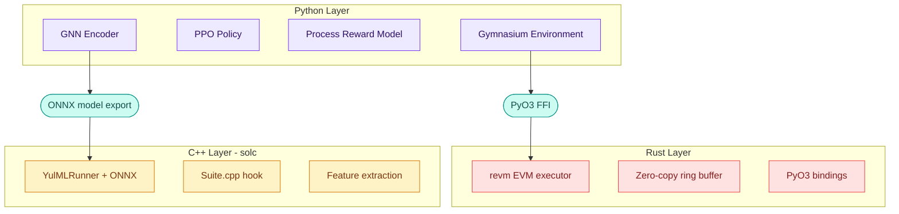

### 3.1 Python Layer

Contains the GNN encoder (PyTorch Geometric `HeteroConv`), PPO policy and value networks, Process Reward Model, and Gymnasium-compatible environment wrapper.

### 3.2 Rust Layer — Gas Measurement via revm

The architecture uses a zero-copy shared memory ring buffer. PyTorch tensors created via `torch.from_blob()` point directly to raw memory addresses that Rust can also read and write. This achieves approximately **100,000 EVM executions per second**.

### 3.3 C++ Layer — Embedding the Model in solc

Three modifications to the Solidity compiler source:

1. A feature extraction pass added to `libyul/optimiser/Suite.cpp`
2. A `YulMLRunner` class wrapping the ONNX Runtime session
3. The default pass sequence string replaced with a call to `YulMLRunner` when `--ml-optimize` is present

### 3.4 The Dual Target — EVM Mainnet and zkEVM

The reward function is the only thing that changes between the EVM mainnet policy and a zkEVM policy. On zkEVM chains, the cost is proof generation measured in PLONK constraint count — which completely inverts several opcode priorities.

```mermaid
flowchart LR
    classDef costly fill:#fee2e2,stroke:#ef4444,color:#7f1d1d
    classDef cheap fill:#dcfce7,stroke:#22c55e,color:#14532d
    classDef flip fill:#fef3c7,stroke:#d97706,color:#78350f
    classDef neutral fill:#f1f5f9,stroke:#94a3b8,color:#1e293b

    subgraph EVM ["EVM Mainnet - gas cost"]
        E1["SSTORE: 20,000 gas"]:::costly
        E2["SLOAD: 2,100 gas"]:::costly
        E3["ECRECOVER: 3,000 gas"]:::flip
        E4["KECCAK256: 30 gas"]:::cheap
        E5["ADD: 3 gas"]:::cheap
    end

    SWITCH(["Same RL architecture\nOnly reward function changes"]):::neutral

    subgraph ZK ["zkEVM - PLONK constraints"]
        Z1["ECRECOVER: 200,000 constraints"]:::costly
        Z2["KECCAK256: 30,000 constraints"]:::costly
        Z3["CALL: 5,000 constraints"]:::flip
        Z4["SSTORE: 300 constraints"]:::cheap
        Z5["ADD: 5 constraints"]:::cheap
    end

    EVM --> SWITCH --> ZK
```

| Opcode      |   EVM Gas    | PLONK Constraints | Priority Flips on zkEVM? |
| ----------- | :----------: | :---------------: | :----------------------: |
| `ADD`       |      3       |        ~5         |            No            |
| `SLOAD`     | 2,100 (cold) |       ~200        |    Yes — much cheaper    |
| `SSTORE`    |    20,000    |       ~300        |    Yes — much cheaper    |
| `KECCAK256` | 30 + 6/word  |      ~30,000      |    Yes — catastrophic    |
| `CALL`      |     100+     |      ~5,000       |         Moderate         |
| `ECRECOVER` |    3,000     |     ~200,000      | Yes — eliminate entirely |

---

## 4. Multi-Agent Extension for Large Contracts

For contracts with many functions, the single-agent framing has a structural problem. Most Yul optimizer passes act locally within function boundaries. The MARL extension assigns one function-level agent per Yul function plus one coordinator agent that determines the order in which agents act.

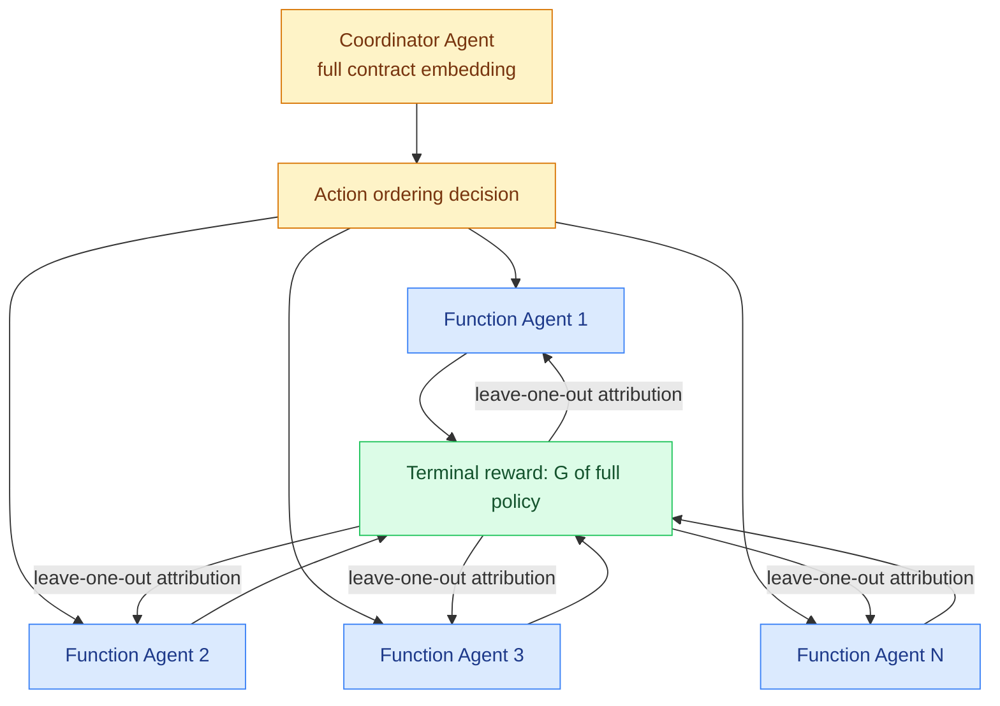

### 4.1 Credit Assignment Across Agents

**Leave-one-out attribution.** For each agent $i$, the marginal contribution $\Delta G_i$ is:

$$\Delta G_i = G\left(\pi_{-i}^{\text{no-op}}\right) - G\left(\pi_{\text{all}}\right)$$

---

## 5. Known Hard Problems and Mitigations

| Problem                                 | Mitigation                                                                     |
| --------------------------------------- | ------------------------------------------------------------------------------ |
| State space explosion from re-encoding  | Yul-string hash cache; ~30–40% of re-encoding calls avoided                    |
| Variance in gas measurement             | Corpus of 10–50 representative calldatas per contract; reward = average gas    |
| Distribution shift (pre-training vs RL) | Augment pre-training with partially-optimized Yul variants                     |
| Dynamic jump resolution in CFG          | Concolic execution; resolves >99% of dynamic jumps                             |
| Out-of-distribution DeFi logic          | GNN-Transformer hybrid; global self-attention unbounded by graph neighbourhood |

---

## 6. Comparative Analysis

| Approach                             | Mechanism                                                              | Key Limitation                                                     |
| ------------------------------------ | ---------------------------------------------------------------------- | ------------------------------------------------------------------ |
| Manual source optimization           | Developer rewrites code                                                | Introduces security risk; requires expertise; does not scale       |
| Pattern matching tools               | Flag known anti-patterns                                               | Cannot discover novel structural optimizations                     |
| LLM code generation                  | Ask LLM to regenerate contract                                         | Hallucination risk; breaks financial logic                         |
| Genetic algorithms on pass sequences | Random search over orderings                                           | No separation of learning from search; one static solution per run |
| **This project**                     | RL policy trained on graph embeddings; generalises to unseen contracts | Frontier research — correctness gate required                      |

---

## 7. The Research Gap

The specific combination of heterogeneous GNN pre-training, PPO-based pass selection with precondition masking, process reward model for dense shaping, and differential fuzzing as a correctness gate does not exist in the literature. Applying RL-for-compiler-pass-ordering (established in LLVM via MLGO 2021) to the EVM and Yul is the novel contribution.

---

## 8. The Bytecode Superoptimizer

The Yul-level agent resolves macro-level phase-ordering, but a Yul pass cannot delete a redundant `SWAP` instruction because `SWAP` does not exist in Yul — it only exists in raw machine code. This component operates strictly post-compilation, directly mutating the sequence of opcodes.

### 8.1 The Bytecode Graph Encoder and Concolic Execution

EVM bytecode relies heavily on dynamic `JUMP` and `JUMPI` instructions with runtime-computed destinations, fragmenting the Control Flow Graph (CFG). The system uses **concolic execution** — hybrid static abstract interpretation plus concrete fuzzing traces — to reconstruct a complete CFG.

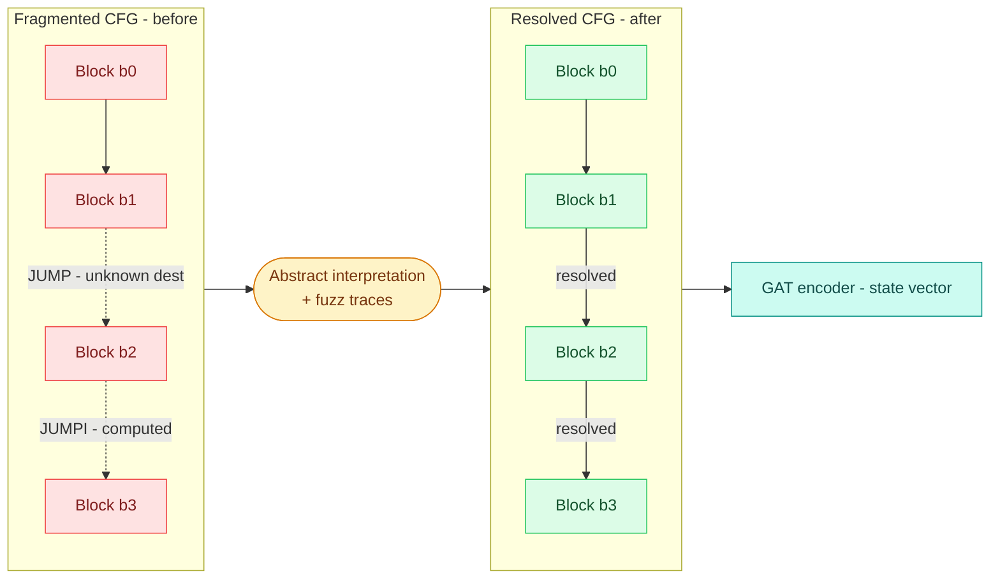

$$\mathcal{E} = \mathcal{E}_{\text{static}} \cup \mathcal{E}_{\text{concolic}}, \quad \mathcal{E}_{\text{concolic}} = \bigcup_{x \in \mathcal{X}_{\text{fuzz}}} \text{Trace}(x)$$

---

### 8.2 The RL Formulation: Constrained Markov Decision Process (CMDP)

Standard RL fails here due to the sparse reward problem: a single incorrect mutation breaks the smart contract. The architecture formulates the environment as a **Constrained Markov Decision Process (CMDP)**, separating the objective from the safety constraint via a Lagrange multiplier whose weight the algorithm discovers automatically.

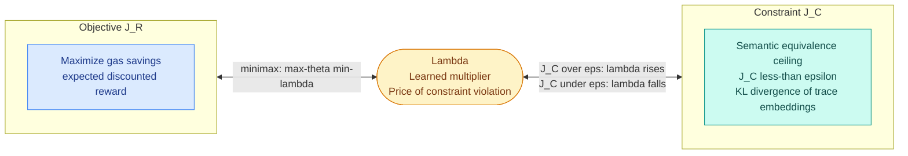

#### 8.2.1 Formulating the CMDP

We define the environment as a tuple $\langle \mathcal{S}, \mathcal{A}, P, R, C, \epsilon \rangle$:

- **State Space:** $s_t = \Phi(\mathcal{G}_t) \in \mathbb{R}^d$ from the GAT encoder.
- **Action Space:** $\mathcal{A} = \mathcal{A}_{\text{insert}} \cup \mathcal{A}_{\text{delete}} \cup \mathcal{A}_{\text{swap}}$ subject to the 16-slot stack constraint.
- **Reward Function:** $R(s_t, a_t) = \text{Gas}(s_t) - \text{Gas}(s_{t+1})$
- **Cost Function:** $C(s_t, a_t) = \mathbb{E}_{x \sim \mathcal{X}}\!\left[D_{\mathrm{KL}}\!\left(\Phi\!\left(T_x(s_{\text{orig}})\right) \,\Big\|\, \Phi\!\left(T_x(s_{\text{mod}})\right)\right)\right]$
- **Constraint:** $J_C(\pi_\theta) \leq \epsilon$

**Objective:**

$$\max_\theta \; J_R(\pi_\theta) = \mathbb{E}_{\tau \sim \pi_\theta}\!\left[\sum_{t=0}^{\infty} \gamma^t R(s_t, a_t)\right]$$

---

#### 8.2.2 Defining the Cost Function $C$

Let $T_x(s)$ be the execution trace for input $x$. We embed each trace as a Gaussian via a small LSTM: $\Phi(T) \sim \mathcal{N}(\mu, \Sigma)$.

$$\boxed{C(s, a) = \mathbb{E}_{x \sim \mathcal{X}}\!\left[D_{\mathrm{KL}}\!\left(\Phi\!\left(T_x(s_{\text{orig}})\right) \,\Big\|\, \Phi\!\left(T_x(s_{\text{mod}})\right)\right)\right]}$$

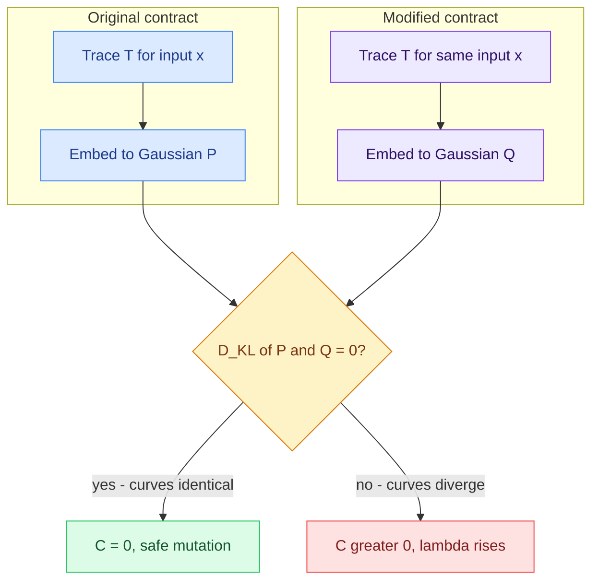

---

#### 8.2.3 Solving via Lagrangian Duality

$$\boxed{\max_\theta \min_{\lambda \geq 0} \; \mathcal{L}(\theta, \lambda) = J_R(\pi_\theta) - \lambda \cdot \left(J_C(\pi_\theta) - \epsilon\right)}$$

By KKT complementary slackness at optimality: $\lambda^* \cdot (J_C(\pi_{\theta^*}) - \epsilon) = 0$

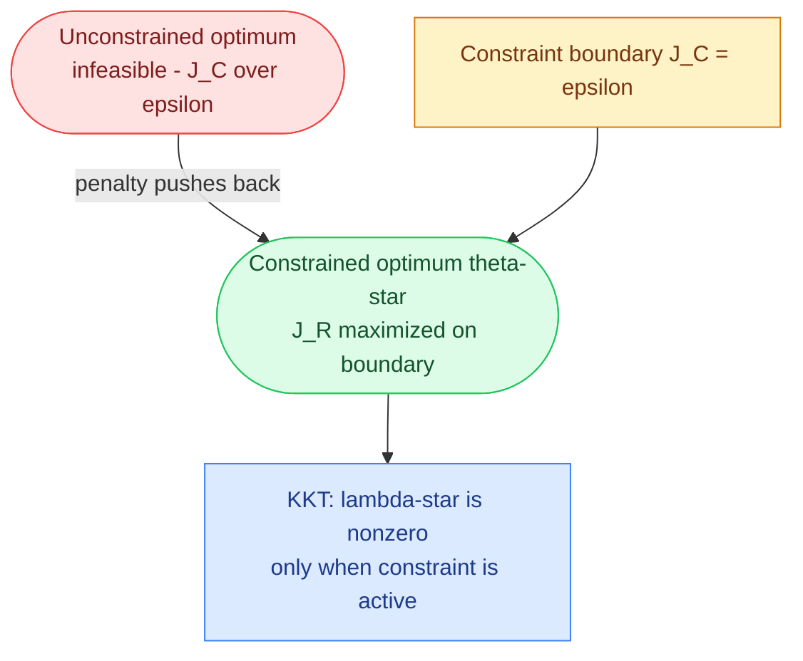

---

#### 8.2.4 Dual Gradient Ascent — The Full Training Algorithm

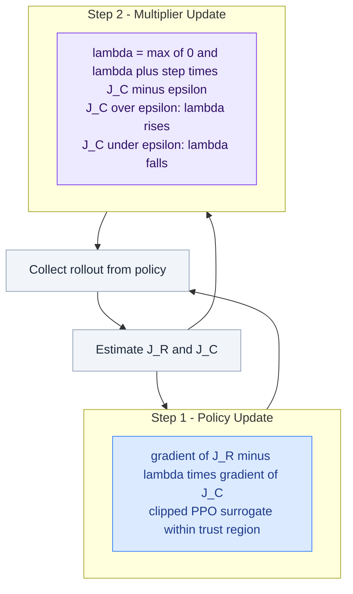

**Step 1 — Policy Update:**

$$\theta_{k+1} = \theta_k + \alpha_\theta \nabla_\theta \mathcal{L}(\theta_k, \lambda_k), \quad \nabla_\theta \mathcal{L} = \nabla_\theta J_R(\pi_{\theta_k}) - \lambda_k \cdot \nabla_\theta J_C(\pi_{\theta_k})$$

**Step 2 — Multiplier Update:**

$$\boxed{\lambda_{k+1} = \max\!\left(0,\; \lambda_k + \alpha_\lambda \left(J_C(\pi_{\theta_k}) - \epsilon\right)\right)}$$

The three observable training phases:

```mermaid
flowchart LR
    classDef explore fill:#fee2e2,stroke:#ef4444,color:#7f1d1d
    classDef converge fill:#fef3c7,stroke:#d97706,color:#78350f
    classDef master fill:#dcfce7,stroke:#22c55e,color:#14532d

    subgraph E ["Phase 1 - Exploration"]
        E1["J_C much greater than epsilon"]:::explore
        E2["Lambda spikes - heavy penalty"]:::explore
        E3["J_R starts low"]:::explore
    end

    subgraph C ["Phase 2 - Convergence"]
        C1["J_C approaches epsilon"]:::converge
        C2["Lambda stabilizes"]:::converge
        C3["J_R climbing"]:::converge
    end

    subgraph M ["Phase 3 - Mastery"]
        M1["J_C below epsilon"]:::master
        M2["Lambda decays to zero"]:::master
        M3["J_R maximized"]:::master
    end

    E --> C --> M
```

| Training Phase    | $J_C$ vs $\epsilon$    | $\lambda$ behaviour          | Agent behaviour                        |
| ----------------- | ---------------------- | ---------------------------- | -------------------------------------- |
| Early exploration | $J_C \gg \epsilon$     | Spikes to large values       | Heavily penalised for unsafe mutations |
| Mid training      | $J_C \approx \epsilon$ | Stabilises at moderate value | Balances safety and gas savings        |
| Late convergence  | $J_C < \epsilon$       | Decays toward 0              | Focuses purely on gas optimization     |

---

#### 8.2.5 The Logical Guarantee

At convergence, under Slater's theorem:

$$J_C(\pi_{\theta^*}) \leq \epsilon \quad \text{and} \quad J_R(\pi_{\theta^*}) = \max_\theta \min_{\lambda \geq 0} \mathcal{L}(\theta, \lambda)$$

---

### 8.3 The 16-Slot Stack Constraint Engine

The EVM physically restricts direct stack manipulation to the top 16 slots (`SWAP1` through `SWAP16`). The agent is prevented from generating invalid bytecode via RL action masking.

$$m_a(s_t) = \begin{cases} 1 & \text{if } \max_{\tau \in \text{Trace}(s_t, a)} d_\tau \leq 16 \\ 0 & \text{otherwise} \end{cases}$$

```mermaid
flowchart LR
    classDef valid fill:#dcfce7,stroke:#22c55e,color:#14532d
    classDef warn fill:#fef3c7,stroke:#d97706,color:#78350f
    classDef blocked fill:#fee2e2,stroke:#ef4444,color:#7f1d1d
    classDef result fill:#ccfbf1,stroke:#0d9488,color:#134e4a

    subgraph STACK ["EVM Stack - 16 slot physical limit"]
        S1["SWAP1 through SWAP14 - valid"]:::valid
        S15["SWAP15 - valid, current depth"]:::warn
        S16["SWAP16 - boundary"]:::warn
        S17["SWAP17 and above - logit set to negative infinity"]:::blocked
    end

    subgraph MASK ["Action mask applied before softmax"]
        MA["m = 1 for valid actions"]:::valid
        MB["m = 0 for depth over 16"]:::blocked
    end

    OUT["Agent learns MSTORE and MLOAD\nfor memory spill instead"]:::result

    STACK --> MASK --> OUT
```

---

### 8.4 The Execution Environment — Zero-Copy Rust

Evaluating the reward requires executing the mutated bytecode to measure gas. The architecture wraps `revm` using a zero-copy shared memory ring buffer, eliminating serialization entirely.

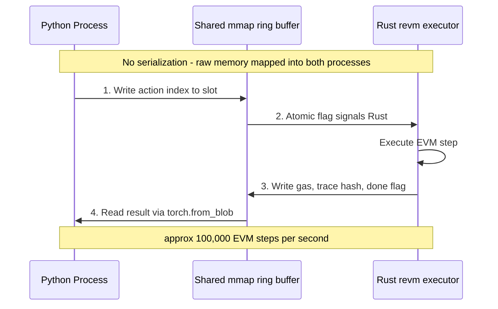

---

### 8.5 The Formal Correctness Gate — Z3 and Uninterpreted Functions

The fatal flaw of theorem provers on smart contracts is `KECCAK256` causing catastrophic state space explosions. The system abstracts it as an **Uninterpreted Function (UIF)** $H$, relying only on mathematical congruence:

$$\forall x.\; \text{input}_{\text{orig}}(x) = \text{input}_{\text{opt}}(x) \implies H\!\left(\text{input}_{\text{orig}}(x)\right) = H\!\left(\text{input}_{\text{opt}}(x)\right)$$

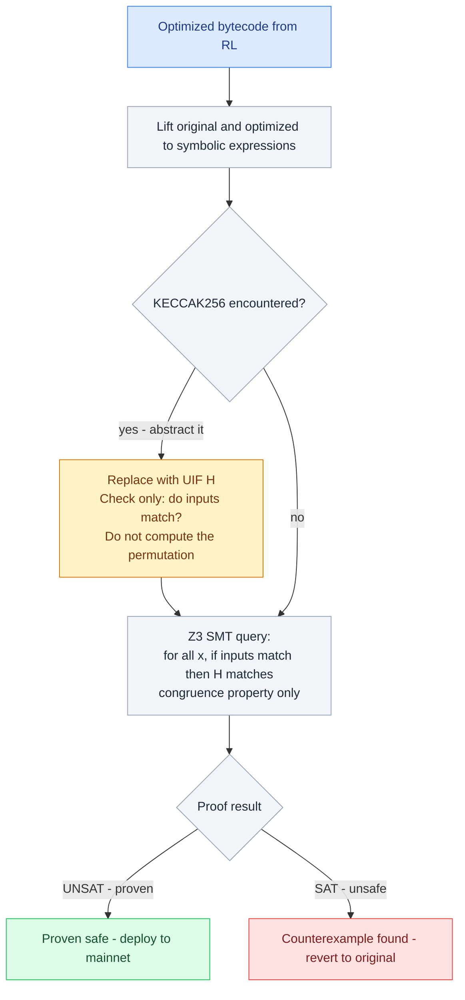

---

## 9. Open Questions

- Should the model be pre-trained per contract category (tokens, AMMs, lending protocols) or trained to generalise across all categories?
- The zkEVM constraint cost table is derived from published circuit design papers but is not guaranteed by any specific implementation. How should the model handle uncertainty in the cost function?
- Is 5% average gas reduction the right success criterion, or should evaluation focus on the tail — how much does the optimizer help for the most complex contracts?
- The correctness gate based on differential fuzzing provides practical safety but not formal guarantees. Is this sufficient for protocols holding significant value?
- At what minimum contract size does the MARL decomposition provide measurable benefit over the single-agent baseline?

---

## 10. Orchestration and DevEx Layer

**The Foundry Plugin.** A lightweight Rust wrapper routes compilation through the custom binary when a developer types `forge build --ml-optimize`.

**The API/Daemon.** The EVM Bytecode Superoptimizer acts as a background daemon. During rapid prototyping, the developer uses the instant Yul-MLGO compiler. For mainnet deployment, `forge build --superoptimize` runs the RL payload for ~10 minutes then verifies with Z3 before returning the final artifact.

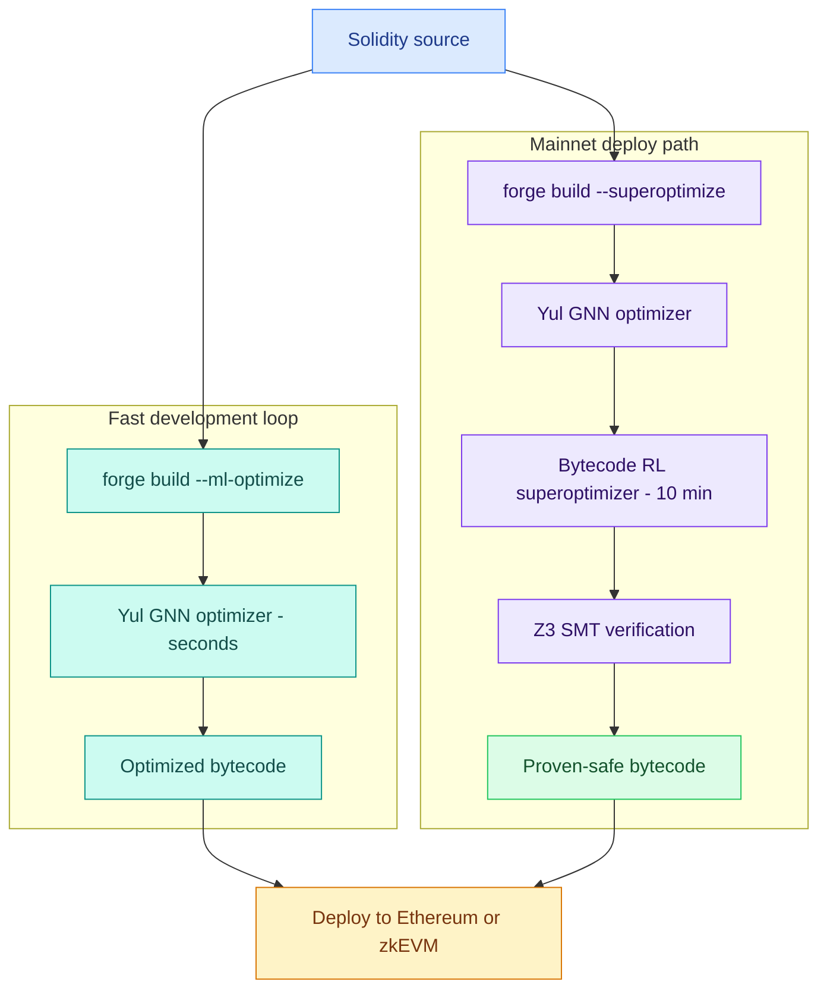

---

## References

1. Fonal, K. (2025, August). _Yul2Vec: Yul Code Embeddings._ MDPI.
2. _Dataset of Yul Contracts to Support Solidity Compiler Research._ arXiv, June 2025.
3. _Exponentially Expanding the Compiler Phase-Ordering Problem's Search Space through the Learning of Dormant Information._ OpenReview, 2023.
4. _POSET-RL: Phase Ordering for Optimizing Size and Execution Time using Reinforcement Learning._ ISPASS, 2022.
5. _G-Scan: Graph Neural Networks for Line-Level Vulnerability Identification in Smart Contracts._ arXiv, 2023.
6. Stooke, A., Achiam, J., & Abbeel, P. (2020). _Responsive Safety in Reinforcement Learning by PID Lagrangian Methods._ ICML.
7. _MLGO: A Machine Learning Guided Compiler Optimizations Framework._ Google, 2021.
8. _Solidity Language Documentation._ Ethereum Foundation.
